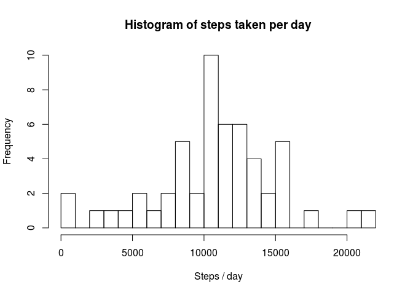
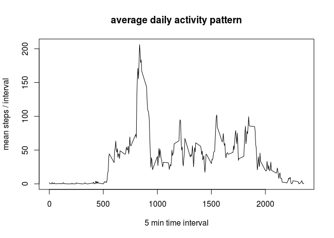
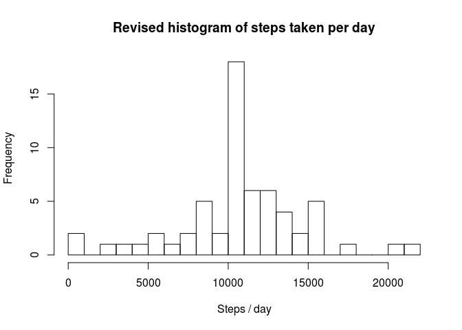
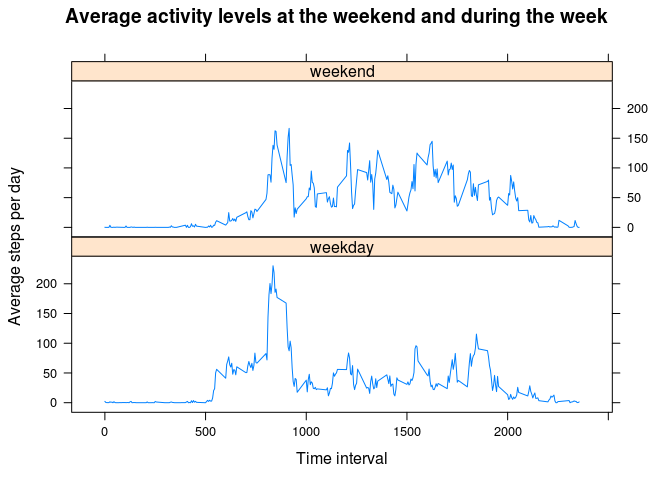

# Reproducible Research: Peer Assessment 1

## Loading and preprocessing the data

- Load the required libraries for the analysis  
- Check if the file has been unzipped, and if not, unzip it  
- Load the file as a csv


```r
library(dplyr)
```

```
## 
## Attaching package: 'dplyr'
## 
## The following objects are masked from 'package:stats':
## 
##     filter, lag
## 
## The following objects are masked from 'package:base':
## 
##     intersect, setdiff, setequal, union
```

```r
library(knitr)
library(lattice)
if(!file.exists("activity.csv")){
    unzip("activity.zip")
}
activity <- read.csv("activity.csv")
```
  
## What is mean total number of steps taken per day?  

- Calculate the total number of steps taken per day
- Use this data to plot a histogram


```r
steps_day <- tapply(activity$steps, activity$date, sum)
hist(steps_day, breaks = 20, main = "Histogram of steps taken per day", xlab = "Steps / day")
```

 

- Calculate the mean and median total number of steps taken per day, express as integers to make them more readable.


```r
mean_steps_day <- as.integer(mean(steps_day, na.rm = TRUE))
median_steps_day <- as.integer(median(steps_day, na.rm = TRUE))
```

The mean total number of steps taken per day is 10766 and the median is 10765.

## What is the average daily activity pattern?

- Group the data by time factor using dplyr and calculate the mean/interval over all available days
- Plot the average daily activity pattern
- Find the time interval with the maximum average steps


```r
int_steps <- summarise(group_by(activity, interval), avg_steps = mean(steps, na.rm=TRUE))
plot(int_steps$interval, int_steps$avg_steps, type="l", xlab="5 min time interval", ylab="mean steps / interval",
     main = "average daily activity pattern")
```

 

```r
max_int <- int_steps$interval[which.max(int_steps$avg_steps)]
```

The time interval with the most steps averaged over all days is 835.  

## Imputing missing values

- Calculate the number of missing steps
- Duplicate the dataset and fill in the missing values from the interval means


```r
miss_steps <- sum(is.na(activity$steps))
activity_avg <- activity
activity_avg$steps[is.na(activity$steps)] <- round(int_steps$avg_steps, digits=0)
```

The total number of missing values in the dataset is 2304.

- After imputing the missing values, plot a revised histogram
- Calculate the mean and median total number of steps taken per day


```r
steps_day_imp <- tapply(activity_avg$steps, activity_avg$date, sum)
hist(steps_day_imp, breaks = 20, main = "Revised histogram of steps taken per day", xlab = "Steps / day")
```

 

```r
mean_steps_day_imp <- as.integer(mean(steps_day_imp))
median_steps_day_imp <- as.integer(median(steps_day_imp))
```

The revised histogram shows a greater frequency of days in the 10,000 to 11,000 steps/day range. The mean total number of steps taken per day accounting for imputed values is 10765 and the median is 10762. As expected, this only differs by a few steps from the mean and median total number of steps per day calculated without imputing missing values.

## Are there differences in activity patterns between weekdays and weekends?

- Extract the days from the dates and use this to create a weekend/weekday factor


```r
activity_avg$day <- weekdays(strptime(activity_avg$date, format="%Y-%m-%d"))
activity_avg$wkend <- as.factor(ifelse(activity_avg$day=="Saturday"|activity_avg$day=="Sunday", 
                                       "weekend", "weekday"))
```

- Group the data by time interval and weekend, before finding the mean steps / interval
- Use lattice to plot the daily activity summary for the weekdays and weekend


```r
int_steps_day <- summarise(group_by(activity_avg, interval, wkend), avg_steps = mean(steps))
xyplot(avg_steps ~ interval | wkend, int_steps_day, xlab="Time interval", ylab="Average steps per day",
       layout=c(1,2), type="l", main = "Average activity levels at the weekend and during the week")
```

 
